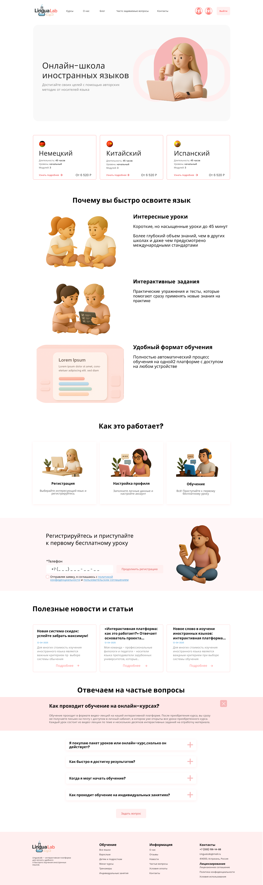

  
  
  
  

<h1 align="center">✨ LinguaLab ✨</h1>
<h3 align="center">Онлайн-школа иностранных языков</h3>

  
  
  
  

---

## 🎨 Дизайн в Figma

  
<i>Кликни на изображение — откроется макет в Figma</i>

  

---

## 📖 О проекте

**LinguaLab** — платформа для изучения иностранных языков.  
Пользователи могут выбирать курсы (немецкий, китайский, испанский и другие), проходить тесты и отслеживать прогресс. Преподаватели управляют контентом.

✨ Дизайн сначала создан в **Figma**, затем реализован в коде.

---

## 🛠 Технологии

| Frontend | Backend |
|----------|---------|
| React 18 | Node.js + Express |
| React Router | MongoDB Atlas |
| CSS Modules | Mongoose |

---

## 📄 Лицензия

MIT © [Maryyyama](https://github.com/Maryyyama)

---

  Сделано с ❤️ для портфолио

